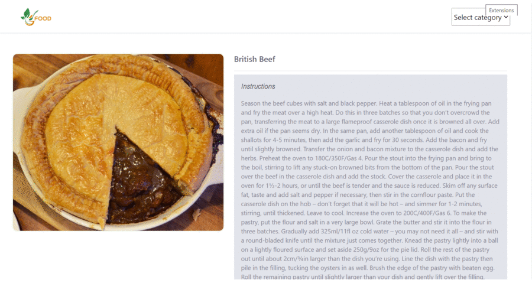

# Catalogue Of Recipes

> This is a recipe catalog based project made using react and redux

Catalog-of-Recipes is a front-end application that will help you retrieve food images from [The mealDB](https://www.themealdb.com/api.php), filter and access details of unique food.



## Built With

- Node.js
- React
- React-DOM
- React-Create-App
- Redux
- CSS
- React-Testing-Library

## Tested With

- Jest
- React-Testing-Library
- redux-mock-store

## Live Demo

[Live Demo Link](http://catalog-recipes-p.herokuapp.com/)

## Getting Started

To get a local copy up and running follow these simple example steps.

### Prerequisites

- NPM
- JavaScript

### Setup

Navigate to your desired location to download the contents of this repository.
In order to clone this repository just type the following commands over the terminal in Linux or Mac or the Windows cmd console.

```s
git clone https://github.com/pacyL2K19/catalogue-of-recipes.git

```

### Install

Run the following commands to install dependencies:

```s
cd catalogue-of-recipes
npm install

```

### Usage

In order to run this project locally, just type this command:

```s
npm start

```

### Test

In order to test this project locally, just type this command:

```s
npm test

```

## Author

👤 **Pacifique Linjanja**

- Github : [@pacyL2K19](https://github.com/pacyL2K19)
- Twitter : [@PacifiqueLinja1](https://twitter.com/PacifiqueLinja1)
- Linkedin : [pacifique-linjanja](https://www.linkedin.com/in/pacifique-linjanja/)

## 🤝 Contributing

Contributions, issues, and feature requests are welcome!

Feel free to check the [issues page](https://github.com/pacyL2K19/Catalogue-of-Recipes/issues).

## Acknowledgments

- [The mealDB](https://www.themealdb.com/api.php)
- Design by Marc-Antoine Roy on [Behance](https://www.behance.net/gallery/11351281/NomNom)
- [Microverse](https://www.microverse.org/)

## Show your support

Give a ⭐️ if you like this project!

## 📝 License

This project is [MIT](LICENSE) licensed.